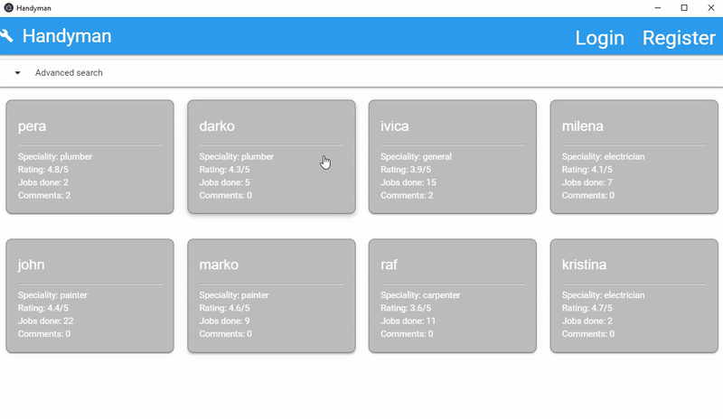

# Handyman Booking (Desktop Electron JS App)

## Introduction
This repository contains desktop application for searching and booking handyman/repairman.

The whole Handyman booking system has desktop application and mobile app. From desktop application users can only browse through the available hadnymen and book the job with them. Handyman, on the other side, must use mobile app for accepting/declining managing jobs. 

Described desktop application is implemented in [Electron JS](https://www.electronjs.org/) with vanilla javascript and [Materialize CSS](https://materializecss.com/). Realtime database from [Firebase](https://firebase.google.com/) was used.

This implementation was done as project work on the course [User Interface Design](https://www.etf.bg.ac.rs/en/fis/karton_predmeta/13M111PKI-2013#gsc.tab=0) on Master's degree in Software Engineering.

## Electron  application demo

1. Users can search for the desired handyman on this system. In order to book the handyman for certain job, they must first create an account and only only then they can book the job with them and manage their bookings.

   

2. After logging in to the app, they would be able to book the job with the selected handyman, by providing all necessary information for the job.

   

## How to run code?

Electron: `v6.0.4`  
Chromium: `v76.0.3809.131`  
Node: `v12.4.0`  

Setting up and running the application:  
- Install all dependencies: `npm install`.  
- Start Electron application: `npm start`. 

In order to show notifications on Windows, please add ElectronJs shortcut to the Start menu.

